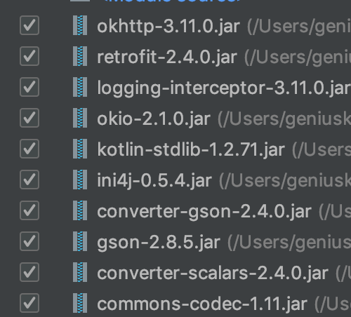

# Solapi-JAVA-Example

## 사용 준비
- [ ] [config.ini](https://github.com/solapi/examples/blob/java/java/src/config.ini)에 정보 입력
  - [ ] ApiKey
  - [ ] ApiSecret

- [ ] 각 Example 사용 시 필요한 정보 (Message ID, Group ID, to, from, text 등) 입력

## 필요한 Library
### [/lib/*](https://github.com/solapi/examples/tree/java/java/lib)

